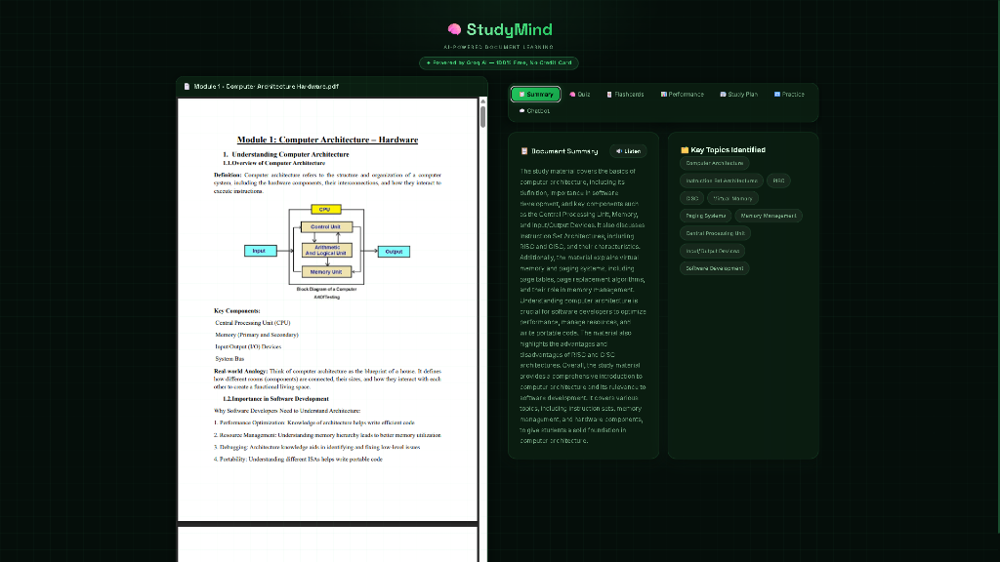
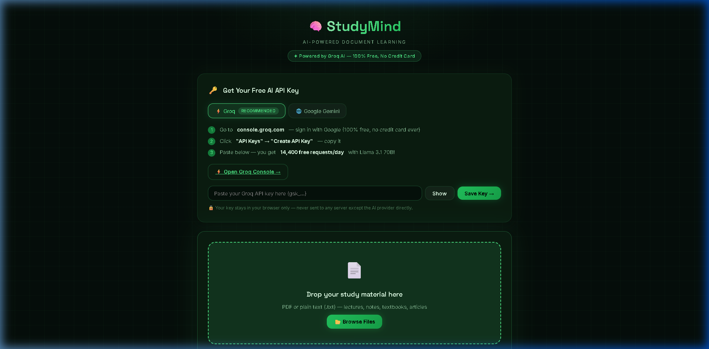

<div align="center">

# 🧠 StudyMind — AI-Powered Document Learning

**Transform any study material into an interactive, personalized learning experience using AI.**

[](https://jyotiprakash769.github.io/Study_Mind/)
[-4ade80?style=for-the-badge)](https://console.groq.com)
[](LICENSE)
[-orange?style=for-the-badge)]()



</div>

---

## 🎬 Demo Video

> Click the image below to watch a live demo of StudyMind in action.


---

## 📖 About

**StudyMind** is a fully browser-based AI study assistant that takes your uploaded **PDFs or text notes** and turns them into a complete, structured learning experience — no backend, no server, no installation required.

Just open `index.html`, paste your free API key, upload a document, and start learning.

---

## ✨ Features

| # | Feature | Description |
|---|---------|-------------|
| 1 | 📄 **Intelligent Document Understanding** | Extracts text from PDFs (up to 40 pages) or plain `.txt` files. Generates a concise AI summary and identifies 6–10 key topics |
| 2 | 🧠 **AI Quiz Generation** | Creates quizzes automatically from your document. Choose **Basic**, **Intermediate**, or **Advanced** difficulty, and set the number of questions (3–20) |
| 3 | ✅ **Answer Evaluation & Feedback** | AI grades every answer with a score (correct / partial / incorrect) and detailed feedback explaining *why* the answer is right or wrong |
| 4 | ⚠️ **Weak Topic Identification** | Tracks your performance per topic across quiz attempts. Visually highlights your weakest areas with a progress bar chart |
| 5 | 🔄 **Adaptive Learning** | Automatically generates a harder, targeted quiz focused on your weak topics to close knowledge gaps faster |
| 6 | 🗓️ **Personalized Study Plan** | Creates a 7-day structured learning roadmap tailored to your topics and weak areas with daily time estimates |
| 7 | 🔁 **Practice & Reinforcement** | Select any topic and generate 5 additional practice questions with hints and model answers |
| 8 | 💬 **Context-Aware Chatbot** | Ask any question about your document. The AI answers *strictly from your uploaded content* — acting as a virtual tutor |
| 9 | 🔊 **Voice Summary** | Converts the document summary into speech using the browser's Web Speech API for auditory learning |

---

## 🚀 Getting Started

### Option A — Run Locally (Recommended)

```bash
# 1. Clone the repository
git clone https://github.com/JyotiPrakash769/Study_Mind.git
cd Study_Mind

# 2. Start a local server (Python required)
python -m http.server 8765

# 3. Open in browser
# → http://localhost:8765
```

### Option B — Open Directly

Just double-click `index.html` to open it in your browser.  
*(Note: PDF extraction works best when served via a local server)*

---

## 🔑 Free API Key Setup

StudyMind supports **two AI providers** — both 100% free:

### ⚡ Groq (Recommended)
| | |
|--|--|
| **Model** | Llama 3.3 70B Versatile |
| **Free limit** | 14,400 requests/day |
| **Credit card** | ❌ Never required |
| **Key format** | `gsk_...` |

1. Go to 👉 [console.groq.com/keys](https://console.groq.com/keys)
2. Sign in with Google → **Create API Key** → Copy it
3. Paste in the app → click **Save Key**

### 🌐 Google Gemini (Alternative)
| | |
|--|--|
| **Model** | Gemini 2.0 Flash Lite |
| **Free limit** | 1,500 requests/day |
| **Credit card** | ❌ Never required |
| **Key format** | `AIza...` |

1. Go to 👉 [aistudio.google.com/app/apikey](https://aistudio.google.com/app/apikey)
2. Sign in → **Create API Key** → Copy it
3. Switch to "Google Gemini" tab in the app → Paste → **Save Key**

> 🔒 **Privacy:** Your API key is stored only in your browser's `localStorage`. It is never sent to any third-party server — only directly to the AI provider's API.

---

## 🖥️ App Walkthrough

### Step 1 — Upload your study material
Drop a PDF (up to 40 pages) or paste your notes directly into the text area and click **Load Document**.

### Step 2 — Review Summary & Topics
The AI instantly generates a summary and identifies key topics. Click **🔊 Listen** to hear the summary read aloud.

### Step 3 — Take a Quiz
Choose your difficulty level, set the number of questions, and click **Generate Quiz**. Submit your answers to get AI-powered evaluation with detailed feedback.

### Step 4 — Track Performance
View your score history chart, see which topics you're weakest in, and click **Adaptive Quiz** to auto-generate a targeted retake.

### Step 5 — Get a Study Plan
Navigate to the **Study Plan** tab and click **Generate Plan** for a personalized 7-day roadmap.

### Step 6 — Practice & Chat
Use the **Practice** tab to drill any specific topic, or use the **Chatbot** to ask questions directly about your document.

---

## 🏗️ Tech Stack

| Technology | Purpose |
|-----------|---------|
| **HTML5** | App structure & semantic layout |
| **Vanilla CSS** | Premium dark theme, glassmorphism, animations |
| **Vanilla JavaScript** | All application logic, no frameworks |
| **PDF.js** | Client-side PDF text extraction (up to 40 pages) |
| **Groq API** | AI inference — Llama 3.3 70B (free tier) |
| **Gemini API** | Alternative AI provider (free tier) |
| **Web Speech API** | Voice summary (browser built-in) |
| **Canvas API** | Performance score history chart |

> ✅ **Zero backend.** Everything runs in the browser. No Node.js, no Python server, no database.

---

## 📁 Project Structure

```
Study_Mind/
├── index.html       # Main app structure & all 6 tabs
├── style.css        # Premium dark green theme
├── app.js           # All AI logic & 9 features
├── assets/
│   ├── screenshot.png   # App screenshot
│   └── demo.webp        # Demo recording
└── README.md
```

---

## 🌐 Deploy to GitHub Pages (Free Hosting)

Host StudyMind publicly for free so anyone can use it:

1. Go to your repo → **Settings** → **Pages**
2. Source: **Deploy from branch → `main` → `/ (root)`**
3. Click **Save**
4. Your app will be live at:  
   👉 `https://jyotiprakash769.github.io/Study_Mind/`

---

## 📸 Screenshots

| Setup Screen | Split-Screen Workspace |
|-------------|----------------|
|  |  |

---

## 🤝 Contributing

Pull requests are welcome! To contribute:

```bash
git clone https://github.com/JyotiPrakash769/Study_Mind.git
cd Study_Mind
# Make your changes to index.html, style.css, or app.js
git add .
git commit -m "feat: your feature description"
git push origin main
```

---

## 📄 License

This project is licensed under the **MIT License** — free to use, modify, and distribute.

---

<div align="center">

**Built with ❤️ by [Jyoti Prakash](https://github.com/JyotiPrakash769)**

⭐ **Star this repo** if you found it useful!

[](https://github.com/JyotiPrakash769/Study_Mind/stargazers)

</div>
